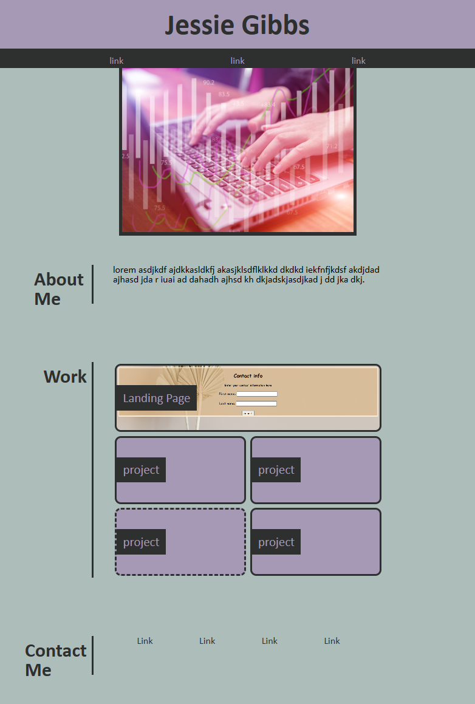

# Jessie Gibb's Portolio

## Description
This is a portfolio page for my work created in U.W.'s Web Development bootcamp. In this project I practiced using flexbox to format a page and psuedo selectors to add effects. In the page are links to my projects with my first on being larger than the rest and on its own row.

    

